<div align="center">


# MemoryMap AI

**A notebook that files itself. Local AI, your machine, nothing sent anywhere.**

[](https://github.com/Braydenh563/MemoryMap-AI/actions/workflows/ci.yml)
[](https://github.com/Braydenh563/MemoryMap-AI/actions/workflows/codeql.yml)
[](https://github.com/Braydenh563/MemoryMap-AI/releases/latest)
[](pyproject.toml)
[](LICENSE)

</div>

---

Type a thought. A local AI files it, tags it and links it to what you
already wrote. Later, ask a question in plain English and get an answer
together with the notes it came from, so you can check it.

```
capture a thought
  -> the AI files it
  -> ask a question
  -> an answer, with the notes behind it
```

The AI files, you decide: everything it does can be seen, edited and
undone. Everything runs on your own computer. No account, no cloud, no
telemetry.
Your notes are a SQLite file in a folder you control, and the app is fully
usable with no AI model running at all.

<p align="center">
  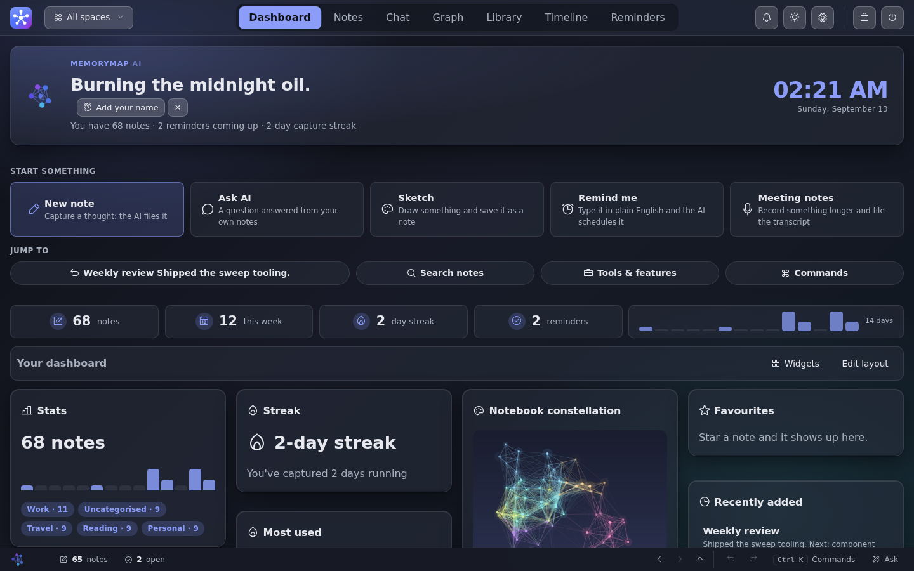
</p>

<details>
<summary><b>Twelve more screenshots</b>: Notes, Chat, Graph, Library, boards, concept maps, Documents, Timeline, Reminders, the features browser, the command palette and Appearance</summary>
<br>

<p align="center">
  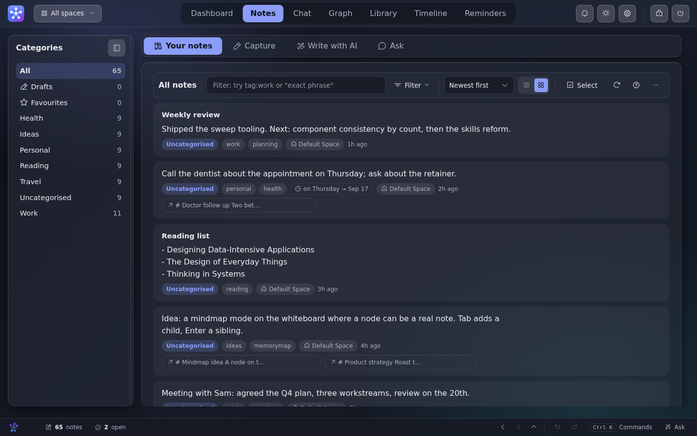
  <br><sub><b>Notes</b>: captured, categorised and linked to what they relate to</sub>
</p>

<p align="center">
  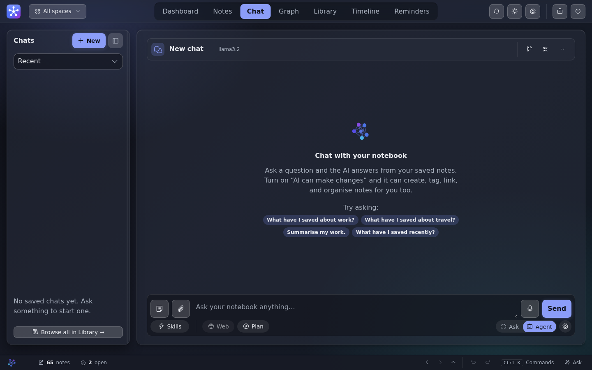
  <br><sub><b>Chat</b>: ask in plain English, with skills, web search and agent mode beside the box</sub>
</p>

<p align="center">
  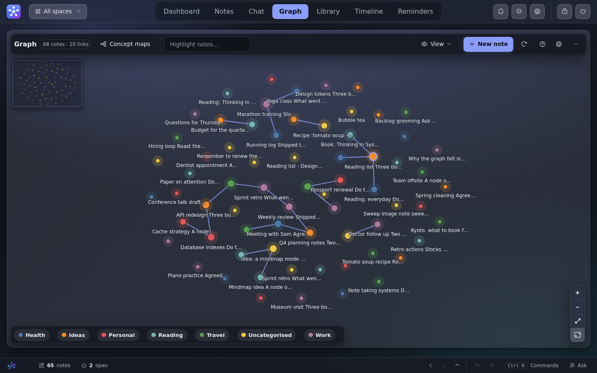
  <br><sub><b>Graph</b>: your notes as a map, coloured by category, linked by meaning</sub>
</p>

<p align="center">
  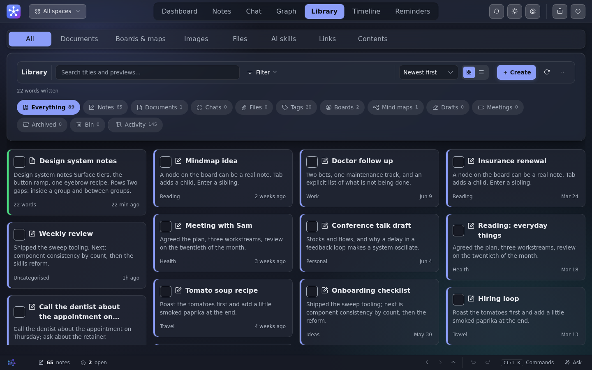
  <br><sub><b>Library</b>: everything you have made, in one place</sub>
</p>

<p align="center">
  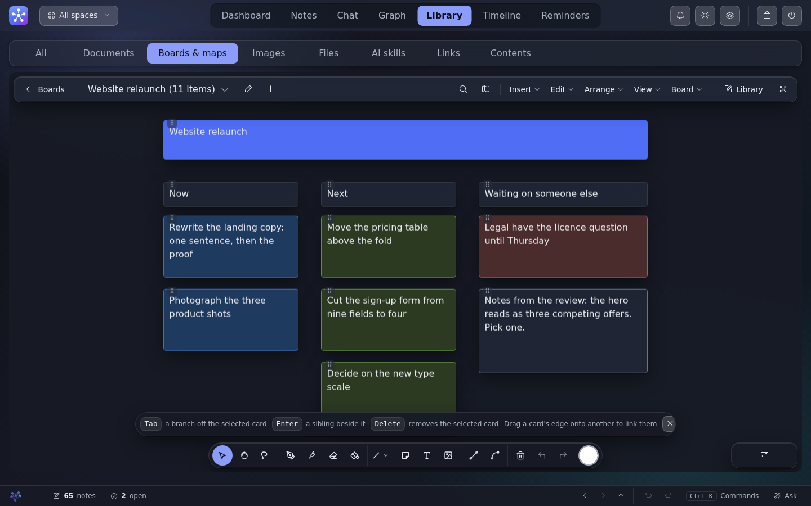
  <br><sub><b>Boards</b>: cards, drawings and images you arrange yourself</sub>
</p>

<p align="center">
  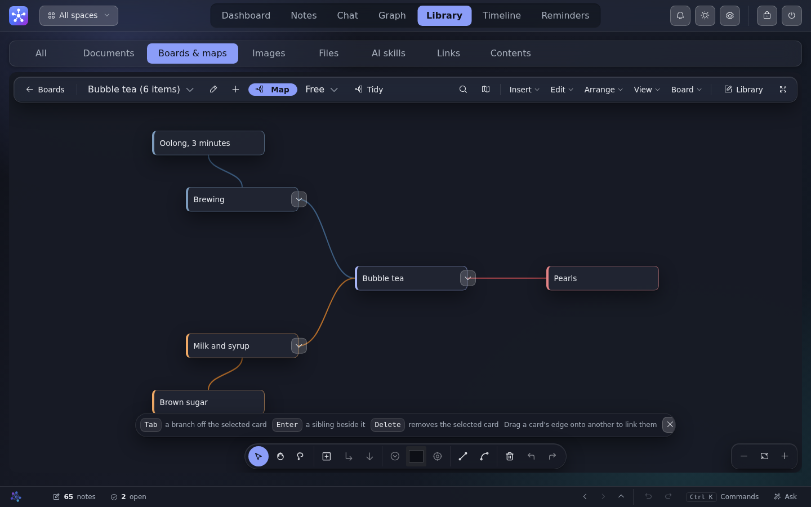
  <br><sub><b>Concept maps</b>: a branch with Tab, one beside it with Enter, tidied on demand</sub>
</p>

<p align="center">
  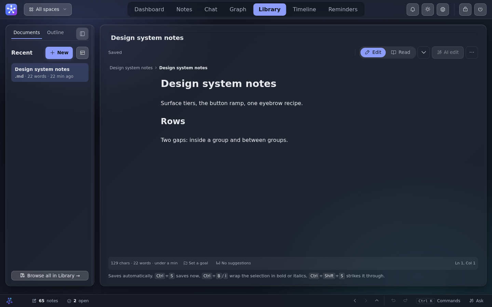
  <br><sub><b>Documents</b>: a long-form editor with four views, writing checks and full history</sub>
</p>

<p align="center">
  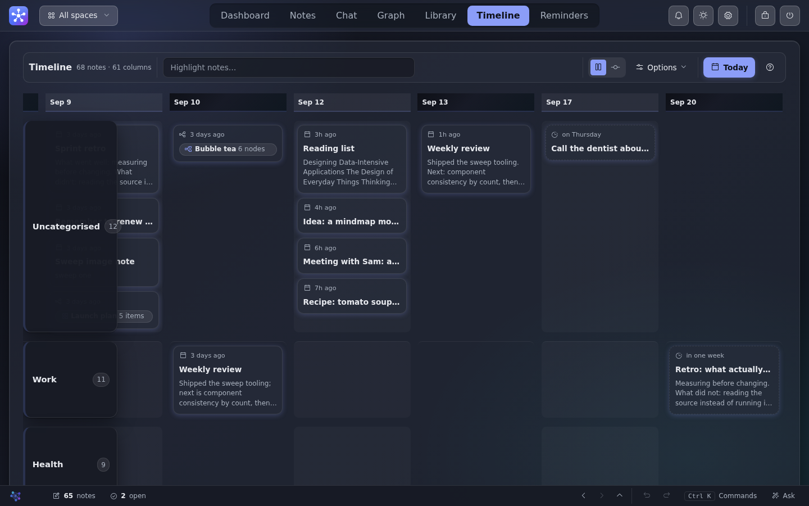
  <br><sub><b>Timeline</b>: every note on a time axis</sub>
</p>

<p align="center">
  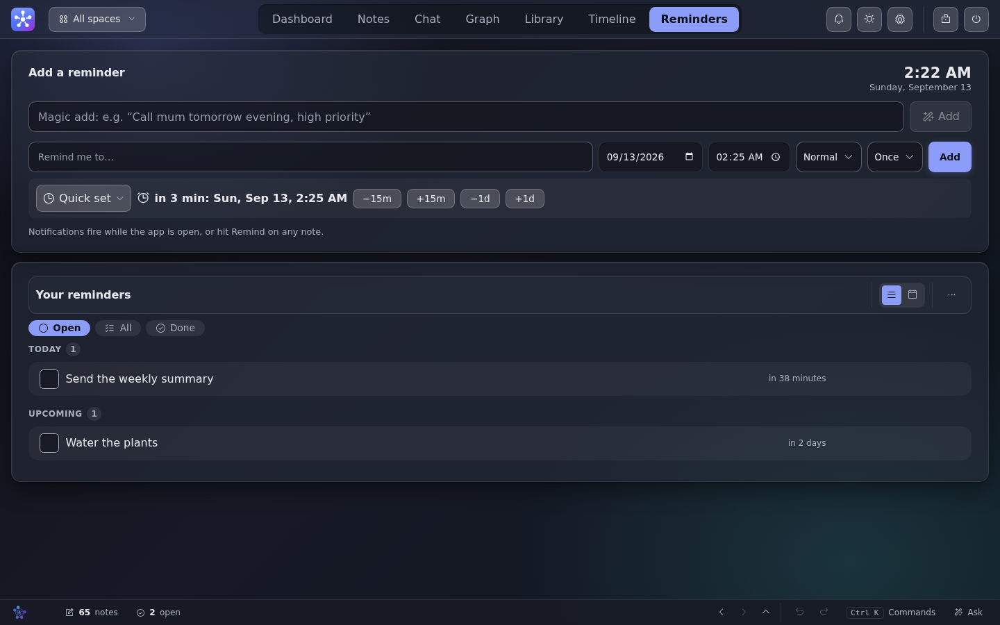
  <br><sub><b>Reminders</b>: due dates linked to the note they came from</sub>
</p>

<p align="center">
  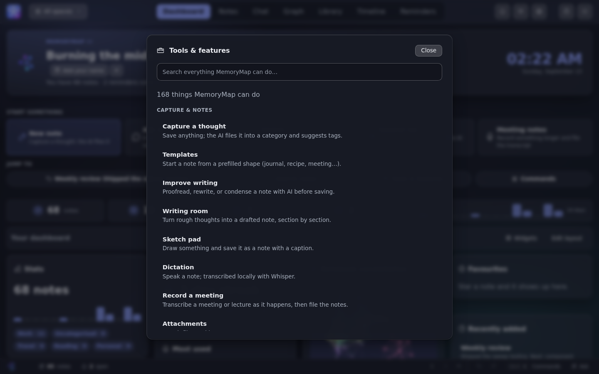
  <br><sub><b>Tools &amp; features</b>: everything the app can do, grouped and searchable</sub>
</p>

<p align="center">
  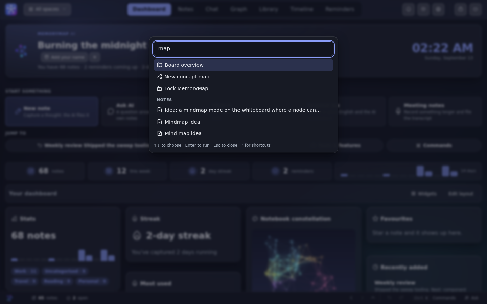
  <br><sub><b>Command palette</b>: Ctrl/⌘-K reaches a command, a note, a document, a file or a board</sub>
</p>

<p align="center">
  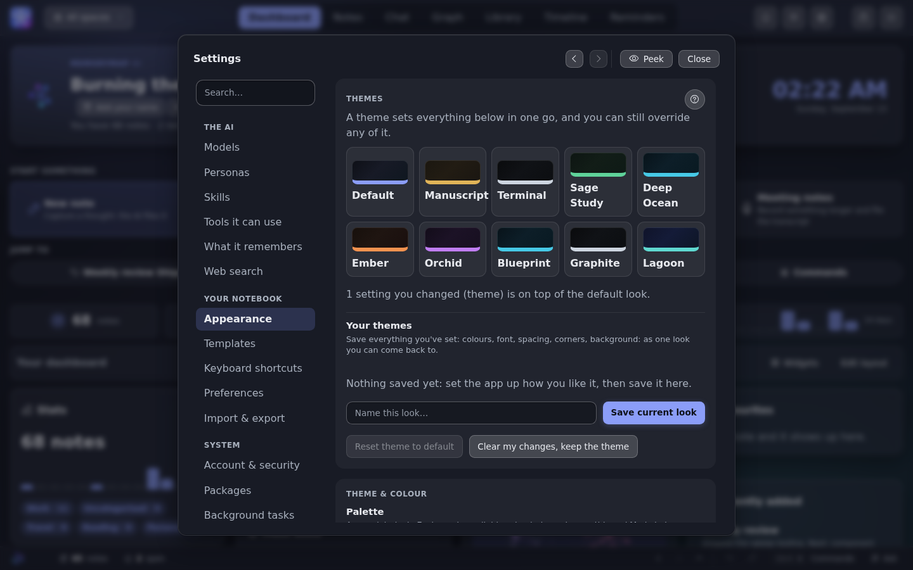
  <br><sub><b>Appearance</b>: ten themes, your own accent, type, density and corners</sub>
</p>

</details>

## Contents

- [Get started](#get-started)
- [What it does](#what-it-does)
- [The AI, and life without it](#the-ai-and-life-without-it)
- [Your data](#your-data)
- [Documentation](#documentation)
- [Developing](#developing)
- [Status](#status)
- [Licence](#licence)

## Get started

Three ways in. None needs a terminal.

**Windows.** Download `MemoryMap-AI-Setup-*.exe` from the
[latest release](https://github.com/Braydenh563/MemoryMap-AI/releases/latest)
and run it. The app opens in its own window.
[What the SmartScreen prompt means](docs/INSTALL.md#windows-installer).

**Linux.** Download `MemoryMap-AI-*-linux-x86_64.zip` from the same page,
unzip it and run `MemoryMap AI`. Needs GTK and WebKit (`python3-gi` and
`gir1.2-webkit2-4.1`, or your distribution's equivalent).

**macOS, or from source on any platform.** Clone the repository and run
`./start-desktop.sh` (on Windows, double-click `start-desktop.bat`), or
`./start.sh` for a browser tab. The launcher builds a private Python
environment, installs everything and opens the app. `--doctor` on either
one checks the machine and prints a table with a fix per row. A
step-by-step version for first-time terminal users is in
[docs/INSTALL.md](docs/INSTALL.md).

Add the AI afterwards: install [Ollama](https://ollama.com) and pull a
model that fits your machine. Which one, from "runs on a laptop with no
GPU" upwards, is in [docs/MODELS.md](docs/MODELS.md). Any OpenAI-compatible
server works too: LM Studio, llama.cpp's `llama-server`, Jan, vLLM.

## What it does

**Capture.** Type, paste, dictate (local Whisper) or draw. The AI picks a
category by meaning, or asks you in guided mode, and says which. Free text
can be split into separate, auto-linked notes. Notes take Markdown inline,
including `[[wiki links]]`, `~~strikethrough~~` and `==highlights==` in
six colours.

**Ask.** A question returns a conversational answer and the notes behind
it, side by side, with each sentence linked to the note it came from. Chat
is saved and resumable. In Agent mode the assistant has 58 tools to
search, link, organise and act on your notebook; anything destructive
asks first, and every step it takes is shown.

**See the shape of it.** The Graph draws your notes as a map, coloured by
category and linked by meaning, with the reason for each link written
down. The Timeline puts every note on a time axis. The Dashboard shows
your capture streak, statistics, a weekly digest and whatever widgets you
choose.

**Write at length.** Documents is a long-form editor with Live, Source,
Split and Read views, a formatting toolbar, spelling and style checks you
can click on, version history, and code files with line numbers.

**Think on a canvas.** The Whiteboard holds sketches, shapes, images and
note cards on a pannable surface. A board can be a **mind map**: a root
topic with branches you grow by hand or from your notes, exportable as
Markdown or OPML.

**Keep everything in one Library.** Notes, documents, chats, files, tags,
bookmarks, the recycle bin and the activity log. Every image you add is
read three ways where each is available (a caption, a vision-model
transcription and Tesseract OCR), all editable, all searchable. Attach any
file to a chat message: images go to a vision model, and documents,
spreadsheets, PDFs and code are imported with their text extracted.
Scanned PDFs are read page by page by an OCR model.

**Remember.** Reminders with priority, repeats and snooze, or type "call
Sam tomorrow evening" and let the AI schedule it.

**Automate.** 20 built-in skills (and your own) run multi-step jobs over
the notebook as a visible checklist, one step at a time, with each tool
call shown. An optional background librarian tags, links and flags
duplicates on a schedule you set. It never deletes anything.

Also: a command palette (`Ctrl`/`Cmd`+`K`), read-aloud, opt-in web search,
themes over several colour palettes, interface zoom, daily local backups,
and an in-app guide under Settings that answers "how do I" questions from
the app's own documentation without ever reading your notes.

## The AI, and life without it

MemoryMap is built around a local model, and built to work when there is
none. With no model running, notes are filed as Uncategorised, search
uses full-text matching with stemming and spelling correction, and every
other feature keeps working. A dot in the header always says what the AI
is doing.

- **Any local model.** Ollama by default; any OpenAI-compatible server by
  setting a URL. Settings > Models shows the sampling parameters and
  starts each at the value the model's own file recommends.
- **Small models are first-class.** Skills and tool use have a small-model
  mode that gives a 4B model one step and one tool at a time, with
  recovery when it skips a step.
- **Search by meaning** is optional and off by default. Turn it on and
  questions match ideas rather than words, using a local embedding model
  through Ollama.
- **Settings > Packages** installs the optional pieces (dictation, the
  desktop window, search by meaning) from inside the app. None of them is
  needed for the core.

## Your data

Everything lives in one folder: `memorymap.db` (your notes), `preferences.json`,
`uploads/` (attachments and sketches) and `backups/` (daily local
snapshots). Set `MEMORYMAP_DATA_DIR` to put it somewhere else. Export to
JSON, CSV or Markdown from Settings at any time.

Nothing leaves your machine unless you ask it to. The server binds to
localhost, the AI is confined to your own network, web search is off by
default and sends only your search words, and private notes are encrypted
at rest with a key derived from your password. The full model, including
session expiry, the CSRF and CSP protections and what to do if you forget
your password, is in [docs/PRIVACY.md](docs/PRIVACY.md). To report a
vulnerability, see [SECURITY.md](SECURITY.md).

## Documentation

| Document | What it answers |
| --- | --- |
| [docs/INSTALL.md](docs/INSTALL.md) | The Windows installer, the launcher script, manual setup, updating and uninstalling |
| [docs/MODELS.md](docs/MODELS.md) | Which model to pick for your machine, and using a backend other than Ollama |
| [docs/PRIVACY.md](docs/PRIVACY.md) | What touches the network and when, private-note encryption, session security |
| [docs/TROUBLESHOOTING.md](docs/TROUBLESHOOTING.md) | The common problems and their fixes |
| [docs/ARCHITECTURE.md](docs/ARCHITECTURE.md) | How the pieces fit: request lifecycle, data model, the AI stack, where to change any given thing |
| [docs/DESIGN.md](docs/DESIGN.md) | The design system every screen is written against |
| [docs/ROADMAP.md](docs/ROADMAP.md) | What is open, in order, with the reasoning |
| [CHANGELOG.md](CHANGELOG.md) | What changed, release by release |
| [CONTRIBUTING.md](CONTRIBUTING.md) | Setup, tests and opening a pull request |
| [SECURITY.md](SECURITY.md) | How to report a vulnerability |

## Developing

```
pytest                          # 3,000+ tests, about eight minutes, fully offline
ruff check .                    # what CI lints with
node --check frontend/app.js    # the frontend has no build step
```

Tests use a throwaway database and fake every AI call, so they need no
GPU, no model and no network. They also cannot see the interface, so a
frontend change is driven in a real browser before it is called done;
[docs/ARCHITECTURE.md](docs/ARCHITECTURE.md) says how.

```
src/memorymap/
  __main__.py     entry point: python -m memorymap [--desktop]
  core/           config, database and migrations, backups, logs, crypto
  entry/          notes: create, read, link, soft-delete, the audit log
  ai/             model clients, filing, the agent and its tools, skills, embeddings, voice
  search/         full-text and semantic search, opt-in web search
  api/            the FastAPI app, one router per feature
frontend/         plain HTML, CSS and JavaScript, served as-is
tests/            pytest, every AI call faked
docs/             user documentation, architecture, design system, roadmap
```

Migrations are additive by default: a new column is added the next time
the app opens an older database. Alembic is wired in behind that for the
day a rename or drop is needed. CI runs ruff, CodeQL and the full suite on
Python 3.11 to 3.13 on every push.

## Status

Version 0.3.0. The core is built and stable: capture, chat, the graph,
documents, the whiteboard and mind maps, private notes, themes, desktop
packaging for Windows and Linux. Current work is a modernisation of the
whole interface and a redesign of the graph, documents, timeline and chat
surfaces, tracked in [docs/ROADMAP.md](docs/ROADMAP.md) and recorded in
[CHANGELOG.md](CHANGELOG.md).

## Licence

[GNU Affero General Public License v3.0](LICENSE).

You may use, study, modify and share this, and anything built on it must
stay under the same licence, including a modified copy run as a network
service. That last clause is why the AGPL was chosen: MemoryMap is a
local-first app, and the licence keeps a closed, hosted version of it from
being offered back to the people it was written for.
